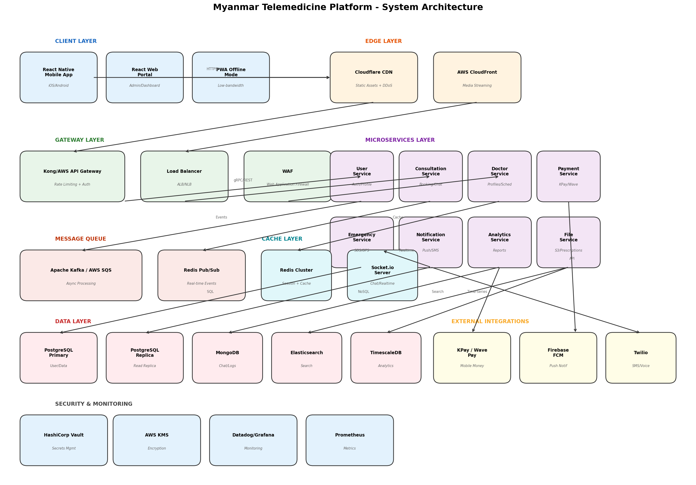
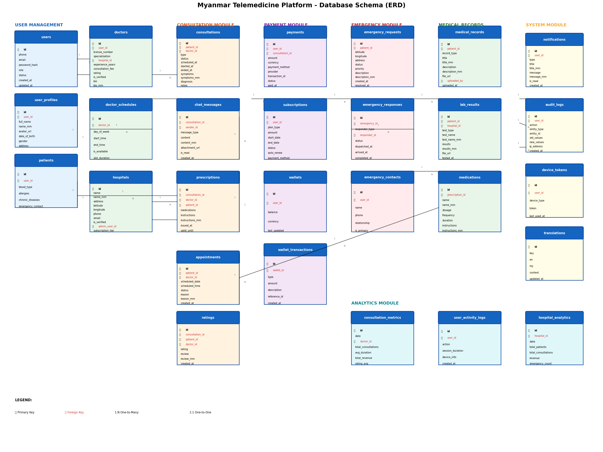

# Myanmar Telemedicine Platform - Technical Specification

## Executive Summary

This document provides a comprehensive technical specification for a telemedicine platform designed specifically for Myanmar, addressing the unique challenges of low-bandwidth connectivity, bilingual support (English + Burmese), and mobile-first healthcare delivery.

---

## 1. System Architecture Overview

### 1.1 Architecture Diagram


### 1.2 Architecture Components

#### Client Layer
| Component | Technology | Purpose |
|-----------|------------|---------|
| Mobile App | React Native | Cross-platform iOS/Android app |
| Web Portal | React.js | Admin dashboards and doctor portals |
| PWA Mode | Service Workers | Offline capability for low-bandwidth areas |

#### Edge Layer
| Component | Technology | Purpose |
|-----------|------------|---------|
| CDN | Cloudflare | Static asset delivery, DDoS protection |
| Media Streaming | AWS CloudFront | Video consultation streaming |

#### Gateway Layer
| Component | Technology | Purpose |
|-----------|------------|---------|
| API Gateway | Kong/AWS API Gateway | Rate limiting, authentication, routing |
| Load Balancer | AWS ALB/NLB | Traffic distribution |
| WAF | AWS WAF | SQL injection, XSS protection |

#### Microservices Layer (8 Core Services)
| Service | Responsibility | Tech Stack |
|---------|---------------|------------|
| User Service | Authentication, profiles, roles | Node.js, JWT, OAuth2 |
| Consultation Service | Booking, chat, video calls | Node.js, Socket.io |
| Doctor Service | Profiles, schedules, verification | Node.js |
| Payment Service | KPay, Wave Pay integration | Node.js |
| Emergency Service | SOS, GPS, dispatch | Node.js, Redis Geo |
| Notification Service | Push, SMS, email | Node.js, Firebase |
| Analytics Service | Reports, dashboards | Python, Pandas |
| File Service | Document storage | Node.js, AWS S3 |

#### Data Layer
| Database | Purpose | Technology |
|----------|---------|------------|
| Primary DB | User data, transactions | PostgreSQL (Primary + Replica) |
| Document Store | Chat messages, logs | MongoDB |
| Search Engine | Full-text search | Elasticsearch |
| Time-Series | Analytics data | TimescaleDB |
| Cache | Session, frequent queries | Redis Cluster |

#### External Integrations
| Service | Provider | Purpose |
|---------|----------|---------|
| Mobile Money | KPay, Wave Pay | Payment processing |
| Push Notifications | Firebase FCM | Cross-platform push |
| SMS/Voice | Twilio | OTP, emergency alerts |

#### Security & Monitoring
| Component | Technology | Purpose |
|-----------|------------|---------|
| Secrets Management | HashiCorp Vault | API keys, credentials |
| Encryption | AWS KMS | Data encryption at rest |
| Monitoring | Datadog/Grafana | Performance metrics |
| Metrics | Prometheus | System metrics |

---

## 2. Database Schema (ERD)

### 2.1 Entity Relationship Diagram


### 2.2 Core Entities

#### User Management Module
```sql
-- users: Core user accounts
CREATE TABLE users (
    id UUID PRIMARY KEY DEFAULT gen_random_uuid(),
    phone VARCHAR(20) UNIQUE NOT NULL,
    email VARCHAR(255) UNIQUE,
    password_hash VARCHAR(255) NOT NULL,
    role ENUM('patient', 'doctor', 'hospital_admin', 'super_admin') DEFAULT 'patient',
    status ENUM('active', 'inactive', 'suspended', 'pending_verification') DEFAULT 'pending_verification',
    preferred_language ENUM('en', 'my') DEFAULT 'my',
    created_at TIMESTAMP DEFAULT CURRENT_TIMESTAMP,
    updated_at TIMESTAMP DEFAULT CURRENT_TIMESTAMP,
    last_login_at TIMESTAMP,
    INDEX idx_phone (phone),
    INDEX idx_role_status (role, status)
);

-- user_profiles: Extended user information
CREATE TABLE user_profiles (
    id UUID PRIMARY KEY DEFAULT gen_random_uuid(),
    user_id UUID UNIQUE REFERENCES users(id) ON DELETE CASCADE,
    full_name VARCHAR(255) NOT NULL,
    name_mm VARCHAR(255), -- Burmese name
    avatar_url VARCHAR(500),
    date_of_birth DATE,
    gender ENUM('male', 'female', 'other'),
    address TEXT,
    address_mm TEXT,
    nrc_number VARCHAR(50), -- Myanmar National Registration Card
    created_at TIMESTAMP DEFAULT CURRENT_TIMESTAMP
);

-- patients: Patient-specific information
CREATE TABLE patients (
    id UUID PRIMARY KEY DEFAULT gen_random_uuid(),
    user_id UUID UNIQUE REFERENCES users(id) ON DELETE CASCADE,
    blood_type ENUM('A+', 'A-', 'B+', 'B-', 'AB+', 'AB-', 'O+', 'O-'),
    allergies JSONB DEFAULT '[]',
    chronic_diseases JSONB DEFAULT '[]',
    emergency_contact_name VARCHAR(255),
    emergency_contact_phone VARCHAR(20),
    created_at TIMESTAMP DEFAULT CURRENT_TIMESTAMP
);
```

#### Medical Professional Module
```sql
-- doctors: Doctor profiles and credentials
CREATE TABLE doctors (
    id UUID PRIMARY KEY DEFAULT gen_random_uuid(),
    user_id UUID UNIQUE REFERENCES users(id) ON DELETE CASCADE,
    license_number VARCHAR(100) NOT NULL UNIQUE,
    specialization VARCHAR(100) NOT NULL,
    hospital_id UUID REFERENCES hospitals(id),
    experience_years INTEGER DEFAULT 0,
    consultation_fee DECIMAL(10,2) DEFAULT 0,
    rating DECIMAL(2,1) DEFAULT 5.0 CHECK (rating >= 0 AND rating <= 5),
    total_consultations INTEGER DEFAULT 0,
    is_verified BOOLEAN DEFAULT FALSE,
    verification_documents JSONB DEFAULT '[]',
    bio TEXT,
    bio_mm TEXT,
    education JSONB DEFAULT '[]',
    created_at TIMESTAMP DEFAULT CURRENT_TIMESTAMP,
    INDEX idx_specialization (specialization),
    INDEX idx_hospital (hospital_id),
    INDEX idx_verified (is_verified, rating)
);

-- doctor_schedules: Weekly availability
CREATE TABLE doctor_schedules (
    id UUID PRIMARY KEY DEFAULT gen_random_uuid(),
    doctor_id UUID REFERENCES doctors(id) ON DELETE CASCADE,
    day_of_week TINYINT NOT NULL CHECK (day_of_week BETWEEN 0 AND 6),
    start_time TIME NOT NULL,
    end_time TIME NOT NULL,
    is_available BOOLEAN DEFAULT TRUE,
    slot_duration INTEGER DEFAULT 30, -- minutes
    max_appointments INTEGER DEFAULT 10,
    created_at TIMESTAMP DEFAULT CURRENT_TIMESTAMP,
    UNIQUE KEY unique_doctor_day (doctor_id, day_of_week)
);

-- hospitals: Healthcare facility information
CREATE TABLE hospitals (
    id UUID PRIMARY KEY DEFAULT gen_random_uuid(),
    name VARCHAR(255) NOT NULL,
    name_mm VARCHAR(255),
    address TEXT NOT NULL,
    address_mm TEXT,
    latitude DECIMAL(10, 8),
    longitude DECIMAL(11, 8),
    phone VARCHAR(20),
    email VARCHAR(255),
    is_verified BOOLEAN DEFAULT FALSE,
    admin_user_id UUID REFERENCES users(id),
    subscription_tier ENUM('free', 'basic', 'premium', 'enterprise') DEFAULT 'free',
    facilities JSONB DEFAULT '[]',
    operating_hours JSONB,
    created_at TIMESTAMP DEFAULT CURRENT_TIMESTAMP,
    INDEX idx_location (latitude, longitude),
    INDEX idx_verified (is_verified)
);
```

#### Consultation Module
```sql
-- consultations: Medical consultation records
CREATE TABLE consultations (
    id UUID PRIMARY KEY DEFAULT gen_random_uuid(),
    patient_id UUID REFERENCES patients(id),
    doctor_id UUID REFERENCES doctors(id),
    type ENUM('video', 'audio', 'chat', 'in_person') DEFAULT 'video',
    status ENUM('scheduled', 'in_progress', 'completed', 'cancelled', 'no_show') DEFAULT 'scheduled',
    scheduled_at TIMESTAMP NOT NULL,
    started_at TIMESTAMP,
    ended_at TIMESTAMP,
    symptoms TEXT,
    symptoms_mm TEXT,
    diagnosis TEXT,
    diagnosis_mm TEXT,
    notes TEXT,
    notes_mm TEXT,
    duration_minutes INTEGER,
    fee DECIMAL(10,2),
    created_at TIMESTAMP DEFAULT CURRENT_TIMESTAMP,
    INDEX idx_patient (patient_id),
    INDEX idx_doctor (doctor_id),
    INDEX idx_status_scheduled (status, scheduled_at)
);

-- chat_messages: Real-time chat storage
CREATE TABLE chat_messages (
    id UUID PRIMARY KEY DEFAULT gen_random_uuid(),
    consultation_id UUID REFERENCES consultations(id) ON DELETE CASCADE,
    sender_id UUID REFERENCES users(id),
    message_type ENUM('text', 'image', 'file', 'voice', 'system') DEFAULT 'text',
    content TEXT,
    content_mm TEXT,
    attachment_url VARCHAR(500),
    attachment_type VARCHAR(50),
    file_size INTEGER,
    is_read BOOLEAN DEFAULT FALSE,
    read_at TIMESTAMP,
    created_at TIMESTAMP DEFAULT CURRENT_TIMESTAMP,
    INDEX idx_consultation (consultation_id, created_at),
    INDEX idx_sender (sender_id)
);

-- prescriptions: Digital prescriptions
CREATE TABLE prescriptions (
    id UUID PRIMARY KEY DEFAULT gen_random_uuid(),
    consultation_id UUID REFERENCES consultations(id),
    doctor_id UUID REFERENCES doctors(id),
    patient_id UUID REFERENCES patients(id),
    prescription_code VARCHAR(50) UNIQUE, -- QR code reference
    medications JSONB NOT NULL,
    instructions TEXT,
    instructions_mm TEXT,
    issued_at TIMESTAMP DEFAULT CURRENT_TIMESTAMP,
    valid_until TIMESTAMP,
    is_active BOOLEAN DEFAULT TRUE,
    INDEX idx_patient (patient_id),
    INDEX idx_code (prescription_code)
);

-- appointments: Scheduled appointments
CREATE TABLE appointments (
    id UUID PRIMARY KEY DEFAULT gen_random_uuid(),
    patient_id UUID REFERENCES patients(id),
    doctor_id UUID REFERENCES doctors(id),
    scheduled_date DATE NOT NULL,
    scheduled_time TIME NOT NULL,
    status ENUM('pending', 'confirmed', 'completed', 'cancelled', 'rescheduled') DEFAULT 'pending',
    reason TEXT,
    reason_mm TEXT,
    cancellation_reason TEXT,
    created_at TIMESTAMP DEFAULT CURRENT_TIMESTAMP,
    INDEX idx_doctor_date (doctor_id, scheduled_date),
    INDEX idx_patient (patient_id)
);

-- ratings: Doctor ratings and reviews
CREATE TABLE ratings (
    id UUID PRIMARY KEY DEFAULT gen_random_uuid(),
    consultation_id UUID REFERENCES consultations(id),
    patient_id UUID REFERENCES patients(id),
    doctor_id UUID REFERENCES doctors(id),
    rating TINYINT NOT NULL CHECK (rating BETWEEN 1 AND 5),
    review TEXT,
    review_mm TEXT,
    is_verified BOOLEAN DEFAULT FALSE,
    created_at TIMESTAMP DEFAULT CURRENT_TIMESTAMP,
    UNIQUE KEY unique_consultation_rating (consultation_id),
    INDEX idx_doctor_rating (doctor_id, rating)
);
```

#### Payment Module
```sql
-- payments: Transaction records
CREATE TABLE payments (
    id UUID PRIMARY KEY DEFAULT gen_random_uuid(),
    user_id UUID REFERENCES users(id),
    consultation_id UUID REFERENCES consultations(id),
    amount DECIMAL(10,2) NOT NULL,
    currency VARCHAR(3) DEFAULT 'MMK',
    payment_method ENUM('kpay', 'wavepay', 'cash', 'wallet') NOT NULL,
    provider VARCHAR(50),
    provider_transaction_id VARCHAR(255),
    status ENUM('pending', 'completed', 'failed', 'refunded', 'cancelled') DEFAULT 'pending',
    metadata JSONB,
    paid_at TIMESTAMP,
    created_at TIMESTAMP DEFAULT CURRENT_TIMESTAMP,
    INDEX idx_user (user_id),
    INDEX idx_status (status),
    INDEX idx_provider_tx (provider_transaction_id)
);

-- subscriptions: Premium subscription plans
CREATE TABLE subscriptions (
    id UUID PRIMARY KEY DEFAULT gen_random_uuid(),
    user_id UUID REFERENCES users(id),
    plan_type ENUM('free', 'basic', 'premium', 'family') DEFAULT 'free',
    amount DECIMAL(10,2),
    start_date DATE NOT NULL,
    end_date DATE NOT NULL,
    status ENUM('active', 'expired', 'cancelled', 'pending') DEFAULT 'pending',
    auto_renew BOOLEAN DEFAULT FALSE,
    payment_method VARCHAR(50),
    created_at TIMESTAMP DEFAULT CURRENT_TIMESTAMP,
    INDEX idx_user_status (user_id, status),
    INDEX idx_end_date (end_date)
);

-- wallets: In-app wallet for credits
CREATE TABLE wallets (
    id UUID PRIMARY KEY DEFAULT gen_random_uuid(),
    user_id UUID UNIQUE REFERENCES users(id),
    balance DECIMAL(10,2) DEFAULT 0,
    currency VARCHAR(3) DEFAULT 'MMK',
    last_updated TIMESTAMP DEFAULT CURRENT_TIMESTAMP,
    INDEX idx_user (user_id)
);

-- wallet_transactions: Wallet transaction history
CREATE TABLE wallet_transactions (
    id UUID PRIMARY KEY DEFAULT gen_random_uuid(),
    wallet_id UUID REFERENCES wallets(id),
    type ENUM('credit', 'debit', 'refund', 'bonus') NOT NULL,
    amount DECIMAL(10,2) NOT NULL,
    description TEXT,
    reference_type VARCHAR(50),
    reference_id UUID,
    balance_after DECIMAL(10,2),
    created_at TIMESTAMP DEFAULT CURRENT_TIMESTAMP,
    INDEX idx_wallet (wallet_id, created_at),
    INDEX idx_reference (reference_type, reference_id)
);
```

#### Emergency Module
```sql
-- emergency_requests: SOS emergency requests
CREATE TABLE emergency_requests (
    id UUID PRIMARY KEY DEFAULT gen_random_uuid(),
    patient_id UUID REFERENCES patients(id),
    latitude DECIMAL(10, 8) NOT NULL,
    longitude DECIMAL(11, 8) NOT NULL,
    address TEXT,
    status ENUM('active', 'dispatched', 'in_progress', 'resolved', 'cancelled') DEFAULT 'active',
    priority ENUM('low', 'medium', 'high', 'critical') DEFAULT 'medium',
    description TEXT,
    description_mm TEXT,
    notified_contacts JSONB DEFAULT '[]',
    created_at TIMESTAMP DEFAULT CURRENT_TIMESTAMP,
    resolved_at TIMESTAMP,
    INDEX idx_status_created (status, created_at),
    INDEX idx_location (latitude, longitude),
    INDEX idx_patient (patient_id)
);

-- emergency_responses: Response tracking
CREATE TABLE emergency_responses (
    id UUID PRIMARY KEY DEFAULT gen_random_uuid(),
    emergency_id UUID REFERENCES emergency_requests(id),
    responder_type ENUM('doctor', 'hospital', 'ambulance') NOT NULL,
    responder_id UUID,
    status ENUM('dispatched', 'en_route', 'arrived', 'completed', 'cancelled') DEFAULT 'dispatched',
    dispatched_at TIMESTAMP DEFAULT CURRENT_TIMESTAMP,
    arrived_at TIMESTAMP,
    completed_at TIMESTAMP,
    notes TEXT,
    INDEX idx_emergency (emergency_id),
    INDEX idx_responder (responder_type, responder_id)
);

-- emergency_contacts: User emergency contacts
CREATE TABLE emergency_contacts (
    id UUID PRIMARY KEY DEFAULT gen_random_uuid(),
    user_id UUID REFERENCES users(id) ON DELETE CASCADE,
    name VARCHAR(255) NOT NULL,
    phone VARCHAR(20) NOT NULL,
    relationship VARCHAR(50),
    is_primary BOOLEAN DEFAULT FALSE,
    created_at TIMESTAMP DEFAULT CURRENT_TIMESTAMP,
    INDEX idx_user (user_id)
);
```

#### Medical Records Module
```sql
-- medical_records: Patient medical history
CREATE TABLE medical_records (
    id UUID PRIMARY KEY DEFAULT gen_random_uuid(),
    patient_id UUID REFERENCES patients(id),
    record_type ENUM('prescription', 'lab_result', 'imaging', 'discharge', 'other') NOT NULL,
    title VARCHAR(255) NOT NULL,
    title_mm VARCHAR(255),
    description TEXT,
    description_mm TEXT,
    file_url VARCHAR(500),
    file_type VARCHAR(50),
    file_size INTEGER,
    uploaded_by UUID REFERENCES users(id),
    is_shareable BOOLEAN DEFAULT FALSE,
    created_at TIMESTAMP DEFAULT CURRENT_TIMESTAMP,
    INDEX idx_patient_type (patient_id, record_type),
    INDEX idx_uploaded (uploaded_by)
);

-- lab_results: Laboratory test results
CREATE TABLE lab_results (
    id UUID PRIMARY KEY DEFAULT gen_random_uuid(),
    patient_id UUID REFERENCES patients(id),
    hospital_id UUID REFERENCES hospitals(id),
    test_type VARCHAR(100) NOT NULL,
    test_name VARCHAR(255) NOT NULL,
    test_name_mm VARCHAR(255),
    results JSONB NOT NULL,
    results_mm TEXT,
    reference_range TEXT,
    is_normal BOOLEAN,
    file_url VARCHAR(500),
    tested_at TIMESTAMP,
    created_at TIMESTAMP DEFAULT CURRENT_TIMESTAMP,
    INDEX idx_patient (patient_id),
    INDEX idx_hospital (hospital_id),
    INDEX idx_tested (tested_at)
);

-- medications: Prescribed medications
CREATE TABLE medications (
    id UUID PRIMARY KEY DEFAULT gen_random_uuid(),
    prescription_id UUID REFERENCES prescriptions(id) ON DELETE CASCADE,
    name VARCHAR(255) NOT NULL,
    name_mm VARCHAR(255),
    dosage VARCHAR(100) NOT NULL,
    frequency VARCHAR(100) NOT NULL,
    duration VARCHAR(100),
    instructions TEXT,
    instructions_mm TEXT,
    created_at TIMESTAMP DEFAULT CURRENT_TIMESTAMP,
    INDEX idx_prescription (prescription_id)
);
```

#### System Module
```sql
-- notifications: User notifications
CREATE TABLE notifications (
    id UUID PRIMARY KEY DEFAULT gen_random_uuid(),
    user_id UUID REFERENCES users(id) ON DELETE CASCADE,
    type ENUM('appointment', 'consultation', 'payment', 'emergency', 'system', 'promo') NOT NULL,
    title VARCHAR(255) NOT NULL,
    title_mm VARCHAR(255),
    message TEXT NOT NULL,
    message_mm TEXT,
    data JSONB,
    is_read BOOLEAN DEFAULT FALSE,
    read_at TIMESTAMP,
    created_at TIMESTAMP DEFAULT CURRENT_TIMESTAMP,
    INDEX idx_user_read (user_id, is_read),
    INDEX idx_created (created_at)
);

-- audit_logs: Activity audit trail
CREATE TABLE audit_logs (
    id UUID PRIMARY KEY DEFAULT gen_random_uuid(),
    user_id UUID REFERENCES users(id),
    action VARCHAR(100) NOT NULL,
    entity_type VARCHAR(50) NOT NULL,
    entity_id UUID,
    old_values JSONB,
    new_values JSONB,
    ip_address INET,
    user_agent TEXT,
    created_at TIMESTAMP DEFAULT CURRENT_TIMESTAMP,
    INDEX idx_user (user_id),
    INDEX idx_entity (entity_type, entity_id),
    INDEX idx_action (action),
    INDEX idx_created (created_at)
);

-- device_tokens: Push notification tokens
CREATE TABLE device_tokens (
    id UUID PRIMARY KEY DEFAULT gen_random_uuid(),
    user_id UUID REFERENCES users(id) ON DELETE CASCADE,
    device_type ENUM('ios', 'android', 'web') NOT NULL,
    token VARCHAR(500) NOT NULL,
    last_used_at TIMESTAMP DEFAULT CURRENT_TIMESTAMP,
    created_at TIMESTAMP DEFAULT CURRENT_TIMESTAMP,
    UNIQUE KEY unique_user_device (user_id, device_type, token),
    INDEX idx_token (token)
);

-- translations: i18n content
CREATE TABLE translations (
    id UUID PRIMARY KEY DEFAULT gen_random_uuid(),
    key VARCHAR(255) UNIQUE NOT NULL,
    en TEXT NOT NULL,
    my TEXT NOT NULL,
    context VARCHAR(100),
    updated_at TIMESTAMP DEFAULT CURRENT_TIMESTAMP,
    INDEX idx_key (key)
);
```

#### Analytics Module
```sql
-- consultation_metrics: Aggregated consultation data
CREATE TABLE consultation_metrics (
    id UUID PRIMARY KEY DEFAULT gen_random_uuid(),
    date DATE NOT NULL,
    doctor_id UUID REFERENCES doctors(id),
    total_consultations INTEGER DEFAULT 0,
    completed_consultations INTEGER DEFAULT 0,
    cancelled_consultations INTEGER DEFAULT 0,
    avg_duration_minutes INTEGER,
    total_revenue DECIMAL(12,2),
    rating_avg DECIMAL(2,1),
    created_at TIMESTAMP DEFAULT CURRENT_TIMESTAMP,
    UNIQUE KEY unique_doctor_date (doctor_id, date),
    INDEX idx_date (date)
);

-- user_activity_logs: User engagement tracking
CREATE TABLE user_activity_logs (
    id UUID PRIMARY KEY DEFAULT gen_random_uuid(),
    user_id UUID REFERENCES users(id),
    action VARCHAR(100) NOT NULL,
    session_duration INTEGER, -- seconds
    device_info JSONB,
    created_at TIMESTAMP DEFAULT CURRENT_TIMESTAMP,
    INDEX idx_user (user_id),
    INDEX idx_action (action),
    INDEX idx_created (created_at)
);

-- hospital_analytics: Hospital performance metrics
CREATE TABLE hospital_analytics (
    id UUID PRIMARY KEY DEFAULT gen_random_uuid(),
    hospital_id UUID REFERENCES hospitals(id),
    date DATE NOT NULL,
    total_patients INTEGER DEFAULT 0,
    new_patients INTEGER DEFAULT 0,
    total_consultations INTEGER DEFAULT 0,
    revenue DECIMAL(12,2),
    emergency_count INTEGER DEFAULT 0,
    avg_wait_time INTEGER, -- minutes
    created_at TIMESTAMP DEFAULT CURRENT_TIMESTAMP,
    UNIQUE KEY unique_hospital_date (hospital_id, date),
    INDEX idx_date (date)
);
```

---

## 3. API Endpoint Structure

### 3.1 RESTful API Endpoints

#### Authentication & User Management
```
POST   /api/v1/auth/register              # User registration
POST   /api/v1/auth/login                 # User login
POST   /api/v1/auth/refresh               # Refresh access token
POST   /api/v1/auth/logout                # User logout
POST   /api/v1/auth/forgot-password       # Password reset request
POST   /api/v1/auth/reset-password        # Reset password with token
POST   /api/v1/auth/verify-phone          # Phone verification (OTP)
POST   /api/v1/auth/verify-email          # Email verification

GET    /api/v1/users/me                   # Get current user
PUT    /api/v1/users/me                   # Update current user
PUT    /api/v1/users/me/avatar            # Update avatar
DELETE /api/v1/users/me                   # Delete account

GET    /api/v1/users/:id/profile          # Get user profile
PUT    /api/v1/users/:id/profile          # Update user profile
```

#### Patient Endpoints
```
GET    /api/v1/patients/me                # Get patient profile
PUT    /api/v1/patients/me                # Update patient profile
GET    /api/v1/patients/me/records        # Get medical records
POST   /api/v1/patients/me/records        # Upload medical record
GET    /api/v1/patients/me/consultations  # Get consultation history
GET    /api/v1/patients/me/appointments   # Get appointments
GET    /api/v1/patients/me/prescriptions  # Get prescriptions
GET    /api/v1/patients/me/wallet         # Get wallet balance

POST   /api/v1/patients/me/emergency-contacts      # Add emergency contact
GET    /api/v1/patients/me/emergency-contacts      # List emergency contacts
PUT    /api/v1/patients/me/emergency-contacts/:id  # Update contact
DELETE /api/v1/patients/me/emergency-contacts/:id  # Delete contact
```

#### Doctor Endpoints
```
GET    /api/v1/doctors                    # List doctors (with filters)
GET    /api/v1/doctors/:id                # Get doctor profile
GET    /api/v1/doctors/:id/schedule       # Get doctor schedule
GET    /api/v1/doctors/:id/reviews        # Get doctor reviews
GET    /api/v1/doctors/:id/availability   # Check availability

POST   /api/v1/doctors/apply              # Apply as doctor
GET    /api/v1/doctors/me                 # Get my doctor profile
PUT    /api/v1/doctors/me                 # Update doctor profile
PUT    /api/v1/doctors/me/schedule        # Update schedule
GET    /api/v1/doctors/me/consultations   # Get my consultations
GET    /api/v1/doctors/me/earnings        # Get earnings report
GET    /api/v1/doctors/me/analytics       # Get performance analytics
```

#### Consultation Endpoints
```
POST   /api/v1/consultations              # Create consultation request
GET    /api/v1/consultations/:id          # Get consultation details
PUT    /api/v1/consultations/:id          # Update consultation
POST   /api/v1/consultations/:id/cancel   # Cancel consultation
POST   /api/v1/consultations/:id/start    # Start consultation
POST   /api/v1/consultations/:id/complete # Complete consultation

GET    /api/v1/consultations/:id/messages # Get chat messages
POST   /api/v1/consultations/:id/messages # Send message
POST   /api/v1/consultations/:id/prescription  # Create prescription
GET    /api/v1/consultations/:id/prescription  # Get prescription

POST   /api/v1/consultations/:id/rate     # Rate consultation
```

#### Appointment Endpoints
```
POST   /api/v1/appointments               # Book appointment
GET    /api/v1/appointments               # List appointments
GET    /api/v1/appointments/:id           # Get appointment details
PUT    /api/v1/appointments/:id           # Reschedule appointment
DELETE /api/v1/appointments/:id           # Cancel appointment
POST   /api/v1/appointments/:id/confirm   # Confirm appointment
```

#### Hospital Endpoints
```
GET    /api/v1/hospitals                  # List hospitals
GET    /api/v1/hospitals/nearby           # Find nearby hospitals
GET    /api/v1/hospitals/:id              # Get hospital details
GET    /api/v1/hospitals/:id/doctors      # Get hospital doctors

POST   /api/v1/hospitals/register         # Register hospital
GET    /api/v1/hospitals/me               # Get my hospital
PUT    /api/v1/hospitals/me               # Update hospital
POST   /api/v1/hospitals/me/doctors       # Add doctor to hospital
DELETE /api/v1/hospitals/me/doctors/:id   # Remove doctor
GET    /api/v1/hospitals/me/analytics     # Hospital analytics
POST   /api/v1/hospitals/me/lab-results   # Upload lab results
```

#### Emergency Endpoints
```
POST   /api/v1/emergency/sos              # Trigger SOS
GET    /api/v1/emergency/:id              # Get emergency status
POST   /api/v1/emergency/:id/cancel       # Cancel emergency
GET    /api/v1/emergency/nearby-doctors   # Find nearby doctors
GET    /api/v1/emergency/nearby-hospitals # Find nearby hospitals
```

#### Payment Endpoints
```
POST   /api/v1/payments                   # Create payment
GET    /api/v1/payments/:id               # Get payment status
GET    /api/v1/payments/history           # Payment history

POST   /api/v1/wallets/topup              # Top up wallet
GET    /api/v1/wallets/transactions       # Wallet transactions

GET    /api/v1/subscriptions/plans        # List subscription plans
POST   /api/v1/subscriptions              # Subscribe to plan
GET    /api/v1/subscriptions/me           # Get my subscription
PUT    /api/v1/subscriptions/me/cancel    # Cancel subscription
```

#### Notification Endpoints
```
GET    /api/v1/notifications              # List notifications
PUT    /api/v1/notifications/:id/read     # Mark as read
PUT    /api/v1/notifications/read-all     # Mark all as read
DELETE /api/v1/notifications/:id          # Delete notification

POST   /api/v1/device-tokens              # Register device token
DELETE /api/v1/device-tokens              # Unregister device token
```

#### Admin Endpoints
```
GET    /api/v1/admin/users                # List all users
PUT    /api/v1/admin/users/:id/status     # Update user status
GET    /api/v1/admin/doctors/pending      # List pending verifications
POST   /api/v1/admin/doctors/:id/verify   # Verify doctor
GET    /api/v1/admin/hospitals/pending    # List pending hospitals
POST   /api/v1/admin/hospitals/:id/verify # Verify hospital
GET    /api/v1/admin/analytics            # Platform analytics
GET    /api/v1/admin/audit-logs           # View audit logs
```

### 3.2 WebSocket Events

#### Connection Events
```javascript
// Client -> Server
socket.emit('join', { userId: string, userType: 'patient' | 'doctor' })
socket.emit('leave', { userId: string })

// Server -> Client
socket.on('connected', { socketId: string })
socket.on('error', { message: string, code: string })
```

#### Consultation Events
```javascript
// Client -> Server
socket.emit('consultation:join', { consultationId: string })
socket.emit('consultation:leave', { consultationId: string })
socket.emit('consultation:message', { 
  consultationId: string, 
  content: string,
  type: 'text' | 'image' | 'file' 
})
socket.emit('consultation:typing', { consultationId: string, isTyping: boolean })
socket.emit('consultation:call-start', { consultationId: string, callType: 'video' | 'audio' })
socket.emit('consultation:call-end', { consultationId: string })

// Server -> Client
socket.on('consultation:user-joined', { userId: string, userType: string })
socket.on('consultation:user-left', { userId: string })
socket.on('consultation:message', { message: ChatMessage })
socket.on('consultation:typing', { userId: string, isTyping: boolean })
socket.on('consultation:call-offer', { offer: RTCSessionDescription, from: string })
socket.on('consultation:call-answer', { answer: RTCSessionDescription, from: string })
socket.on('consultation:ice-candidate', { candidate: RTCIceCandidate, from: string })
```

#### Emergency Events
```javascript
// Client -> Server
socket.emit('emergency:request', { 
  latitude: number, 
  longitude: number, 
  description?: string 
})
socket.emit('emergency:respond', { emergencyId: string, responderId: string })
socket.emit('emergency:update-location', { 
  emergencyId: string, 
  latitude: number, 
  longitude: number 
})

// Server -> Client
socket.on('emergency:created', { emergencyId: string, status: string })
socket.on('emergency:responder-assigned', { responder: ResponderInfo })
socket.on('emergency:location-update', { latitude: number, longitude: number })
socket.on('emergency:resolved', { emergencyId: string, resolvedAt: Date })
```

#### Notification Events
```javascript
// Server -> Client (push notifications via socket)
socket.on('notification:new', { notification: Notification })
socket.on('notification:appointment-reminder', { appointmentId: string, timeUntil: number })
socket.on('notification:consultation-starting', { consultationId: string, startsIn: number })
```

#### Presence Events
```javascript
// Client -> Server
socket.emit('presence:update', { status: 'online' | 'away' | 'busy' | 'offline' })

// Server -> Client
socket.on('presence:update', { userId: string, status: string, lastSeen?: Date })
```

### 3.3 API Response Format

#### Success Response
```json
{
  "success": true,
  "data": { ... },
  "meta": {
    "page": 1,
    "limit": 20,
    "total": 100,
    "totalPages": 5
  }
}
```

#### Error Response
```json
{
  "success": false,
  "error": {
    "code": "VALIDATION_ERROR",
    "message": "Invalid input data",
    "details": [
      { "field": "email", "message": "Email is required" }
    ]
  }
}
```

---

## 4. Security Implementation Checklist

### 4.1 Authentication & Authorization

| # | Requirement | Implementation | Priority |
|---|-------------|----------------|----------|
| 1 | JWT-based authentication | Access token (15min) + Refresh token (7 days) | Critical |
| 2 | Password security | bcrypt with salt rounds 12+ | Critical |
| 3 | Multi-factor authentication | SMS OTP for sensitive operations | High |
| 4 | Role-based access control (RBAC) | Middleware for role verification | Critical |
| 5 | Session management | Redis-backed session store with TTL | High |
| 6 | Token revocation | Blacklist for logged-out tokens | High |
| 7 | Account lockout | 5 failed attempts = 15min lockout | Medium |

### 4.2 Data Protection

| # | Requirement | Implementation | Priority |
|---|-------------|----------------|----------|
| 8 | Encryption at rest | AES-256 for database fields | Critical |
| 9 | Encryption in transit | TLS 1.3 for all communications | Critical |
| 10 | PHI encryption | Separate encryption keys for health data | Critical |
| 11 | Field-level encryption | Encrypt NRC, phone numbers | High |
| 12 | Secure key management | HashiCorp Vault integration | Critical |
| 13 | Key rotation | Automatic 90-day rotation | High |
| 14 | Data masking | Mask sensitive data in logs | High |

### 4.3 API Security

| # | Requirement | Implementation | Priority |
|---|-------------|----------------|----------|
| 15 | Rate limiting | 100 req/min per IP, 1000 req/min per user | Critical |
| 16 | Input validation | Joi/Zod schema validation | Critical |
| 17 | SQL injection prevention | Parameterized queries only | Critical |
| 18 | XSS protection | Content Security Policy headers | High |
| 19 | CSRF protection | CSRF tokens for state-changing ops | High |
| 20 | Request size limits | 10MB max for uploads | Medium |
| 21 | CORS configuration | Whitelist allowed origins | High |

### 4.4 Infrastructure Security

| # | Requirement | Implementation | Priority |
|---|-------------|----------------|----------|
| 22 | Network segmentation | VPC with private subnets | Critical |
| 23 | WAF protection | AWS WAF with OWASP rules | Critical |
| 24 | DDoS protection | Cloudflare/AWS Shield | Critical |
| 25 | Security groups | Least privilege access rules | Critical |
| 26 | Bastion hosts | Jump server for SSH access | High |
| 27 | VPN for admin access | Required for production access | High |

### 4.5 Audit & Monitoring

| # | Requirement | Implementation | Priority |
|---|-------------|----------------|----------|
| 28 | Audit logging | All PHI access logged | Critical |
| 29 | Failed login monitoring | Alert on suspicious patterns | High |
| 30 | Intrusion detection | AWS GuardDuty / Datadog | High |
| 31 | Log retention | 7 years for audit logs | Critical |
| 32 | Log encryption | Encrypted log storage | High |
| 33 | Real-time alerts | PagerDuty for security events | High |

### 4.6 Compliance

| # | Requirement | Implementation | Priority |
|---|-------------|----------------|----------|
| 34 | Data localization | Myanmar data stays in Myanmar | Critical |
| 35 | Consent management | Explicit consent for data use | Critical |
| 36 | Data retention policy | Auto-delete after retention period | High |
| 37 | Right to deletion | User can request data deletion | High |
| 38 | Breach notification | 72-hour notification process | Critical |
| 39 | Regular security audits | Quarterly penetration testing | High |

---

## 5. Mobile App Screen Flow & Component Structure

### 5.1 Screen Flow Diagram

```
┌─────────────────────────────────────────────────────────────────────────────┐
│                           APP ENTRY POINTS                                   │
└─────────────────────────────────────────────────────────────────────────────┘
                                    │
            ┌───────────────────────┼───────────────────────┐
            ▼                       ▼                       ▼
    ┌───────────────┐      ┌───────────────┐      ┌───────────────┐
    │ Splash Screen │      │  Deep Link    │      │ Push Notif    │
    └───────┬───────┘      └───────┬───────┘      └───────┬───────┘
            │                       │                       │
            └───────────────────────┼───────────────────────┘
                                    ▼
                    ┌───────────────────────────┐
                    │    Authentication Flow    │
                    │  (Login / Register / OTP) │
                    └─────────────┬─────────────┘
                                  │
                    ┌─────────────┴─────────────┐
                    ▼                           ▼
        ┌───────────────────┐      ┌───────────────────┐
        │   Patient App     │      │   Doctor App      │
        │   (Main Flow)     │      │   (Main Flow)     │
        └─────────┬─────────┘      └─────────┬─────────┘
                  │                            │
    ┌─────────────┼─────────────┐    ┌────────┴────────┐
    ▼             ▼             ▼    ▼                 ▼
┌───────┐   ┌─────────┐   ┌────────┐ ┌──────────┐  ┌──────────┐
│ Home  │   │Consult  │   │Profile │ │Dashboard │  │Schedule  │
│       │   │         │   │        │ │          │  │          │
│•SOS   │   │•Book    │   │•Records│ │•Requests │  │•Set Avail│
│•Nearby│   │•History │   │•Wallet │ │•Earnings │  │•View Appt│
│•Appts │   │•Chat    │   │•Settings│ │•Analytics│  │          │
└───┬───┘   └────┬────┘   └───┬────┘ └────┬─────┘  └────┬─────┘
    │            │            │           │             │
    ▼            ▼            ▼           ▼             ▼
┌────────┐  ┌────────┐  ┌────────┐  ┌────────┐   ┌────────┐
│Emergency│  │Video   │  │Prescrip│  │Patient │   │Consult │
│  Flow   │  │ Call   │  │  tion  │  │  List  │   │ Detail │
└────────┘  └────────┘  └────────┘  └────────┘   └────────┘
```

### 5.2 Component Structure

```
src/
├── components/
│   ├── common/
│   │   ├── Button/
│   │   ├── Input/
│   │   ├── Card/
│   │   ├── Avatar/
│   │   ├── Loading/
│   │   ├── ErrorBoundary/
│   │   └── LanguageSwitcher/
│   ├── consultation/
│   │   ├── VideoCall/
│   │   ├── Chat/
│   │   ├── ConsultationCard/
│   │   ├── PrescriptionView/
│   │   └── RatingModal/
│   ├── emergency/
│   │   ├── SOSButton/
│   │   ├── EmergencyMap/
│   │   ├── ResponderCard/
│   │   └── EmergencyStatus/
│   ├── payment/
│   │   ├── PaymentModal/
│   │   ├── WalletCard/
│   │   └── TransactionList/
│   └── doctor/
│       ├── DoctorCard/
│       ├── DoctorSchedule/
│       ├── AvailabilityPicker/
│       └── RatingStars/
├── screens/
│   ├── auth/
│   │   ├── LoginScreen/
│   │   ├── RegisterScreen/
│   │   ├── OTPScreen/
│   │   └── ForgotPasswordScreen/
│   ├── patient/
│   │   ├── HomeScreen/
│   │   ├── DoctorsListScreen/
│   │   ├── DoctorProfileScreen/
│   │   ├── BookConsultationScreen/
│   │   ├── ConsultationScreen/
│   │   ├── MedicalRecordsScreen/
│   │   ├── PrescriptionsScreen/
│   │   ├── AppointmentsScreen/
│   │   ├── WalletScreen/
│   │   ├── ProfileScreen/
│   │   └── EmergencyScreen/
│   ├── doctor/
│   │   ├── DoctorDashboardScreen/
│   │   ├── ConsultationRequestsScreen/
│   │   ├── PatientDetailScreen/
│   │   ├── ScheduleManagementScreen/
│   │   ├── EarningsScreen/
│   │   └── DoctorProfileEditScreen/
│   └── hospital/
│       ├── HospitalDashboardScreen/
│       ├── DoctorManagementScreen/
│       ├── LabResultsUploadScreen/
│       └── HospitalAnalyticsScreen/
├── navigation/
│   ├── AuthNavigator/
│   ├── PatientNavigator/
│   ├── DoctorNavigator/
│   └── HospitalNavigator/
├── hooks/
│   ├── useAuth/
│   ├── useConsultation/
│   ├── useLocation/
│   ├── useNotifications/
│   ├── useOffline/
│   └── useTranslation/
├── services/
│   ├── api/
│   │   ├── client.ts
│   │   ├── auth.ts
│   │   ├── consultations.ts
│   │   ├── doctors.ts
│   │   ├── payments.ts
│   │   └── emergency.ts
│   ├── socket/
│   │   └── socketClient.ts
│   ├── storage/
│   │   └── asyncStorage.ts
│   └── notifications/
│       └── pushNotifications.ts
├── store/
│   ├── slices/
│   │   ├── authSlice.ts
│   │   ├── consultationSlice.ts
│   │   ├── doctorSlice.ts
│   │   └── uiSlice.ts
│   └── store.ts
├── utils/
│   ├── constants.ts
│   ├── validators.ts
│   ├── formatters.ts
│   ├── encryption.ts
│   └── helpers.ts
├── i18n/
│   ├── en.json
│   ├── my.json
│   └── i18n.ts
└── App.tsx
```

### 5.3 Key Features Implementation

#### Offline Mode Support
```typescript
// Offline queue for actions
interface OfflineAction {
  id: string;
  type: 'message' | 'appointment' | 'payment';
  payload: any;
  timestamp: number;
  retryCount: number;
}

// Sync when back online
const syncOfflineData = async () => {
  const pendingActions = await getPendingActions();
  for (const action of pendingActions) {
    try {
      await processAction(action);
      await removePendingAction(action.id);
    } catch (error) {
      if (action.retryCount < 3) {
        await incrementRetryCount(action.id);
      }
    }
  }
};
```

#### Low-Bandwidth Optimization
```typescript
// Image optimization
const optimizeImage = async (uri: string, quality: number = 0.7) => {
  return await ImageManipulator.manipulateAsync(
    uri,
    [{ resize: { width: 800 } }],
    { compress: quality, format: ImageManipulator.SaveFormat.JPEG }
  );
};

// Data compression for API calls
const compressPayload = (data: any) => {
  return gzip(JSON.stringify(data));
};

// Lazy loading with pagination
const usePaginatedData = (fetcher: Function, pageSize: number = 10) => {
  const [data, setData] = useState([]);
  const [page, setPage] = useState(1);
  const [hasMore, setHasMore] = useState(true);
  
  const loadMore = async () => {
    const result = await fetcher(page, pageSize);
    setData(prev => [...prev, ...result.data]);
    setHasMore(result.data.length === pageSize);
    setPage(p => p + 1);
  };
  
  return { data, loadMore, hasMore, refreshing };
};
```

---

## 6. Recommended Folder/Project Structure

### 6.1 Monorepo Structure

```
myanmar-telemedicine/
├── 📁 apps/
│   ├── 📁 mobile/                          # React Native App
│   │   ├── 📁 android/
│   │   ├── 📁 ios/
│   │   ├── 📁 src/
│   │   ├── 📄 package.json
│   │   └── 📄 app.json
│   ├── 📁 web/                             # React Web Portal
│   │   ├── 📁 public/
│   │   ├── 📁 src/
│   │   ├── 📄 package.json
│   │   └── 📄 next.config.js
│   └── 📁 admin/                           # Admin Dashboard
│       ├── 📁 src/
│       └── 📄 package.json
│
├── 📁 services/                            # Microservices
│   ├── 📁 api-gateway/                     # Kong/API Gateway config
│   │   ├── 📁 config/
│   │   └── 📄 docker-compose.yml
│   ├── 📁 user-service/
│   │   ├── 📁 src/
│   │   ├── 📁 tests/
│   │   ├── 📄 Dockerfile
│   │   └── 📄 package.json
│   ├── 📁 consultation-service/
│   │   ├── 📁 src/
│   │   ├── 📁 tests/
│   │   ├── 📄 Dockerfile
│   │   └── 📄 package.json
│   ├── 📁 doctor-service/
│   ├── 📁 payment-service/
│   ├── 📁 emergency-service/
│   ├── 📁 notification-service/
│   ├── 📁 analytics-service/
│   └── 📁 file-service/
│
├── 📁 infrastructure/                      # Infrastructure as Code
│   ├── 📁 terraform/                       # AWS infrastructure
│   │   ├── 📁 modules/
│   │   ├── 📁 environments/
│   │   │   ├── 📁 dev/
│   │   │   ├── 📁 staging/
│   │   │   └── 📁 production/
│   │   └── 📄 main.tf
│   ├── 📁 kubernetes/                      # K8s manifests
│   │   ├── 📁 base/
│   │   └── 📁 overlays/
│   ├── 📁 docker/                          # Docker configs
│   └── 📁 scripts/                         # Deployment scripts
│
├── 📁 shared/                              # Shared packages
│   ├── 📁 types/                           # TypeScript types
│   ├── 📁 constants/                       # Shared constants
│   ├── 📁 utils/                           # Shared utilities
│   └── 📁 ui-components/                   # Shared UI components
│
├── 📁 docs/                                # Documentation
│   ├── 📁 api/
│   ├── 📁 architecture/
│   ├── 📁 deployment/
│   └── 📁 security/
│
├── 📁 database/
│   ├── 📁 migrations/
│   ├── 📁 seeds/
│   └── 📁 schemas/
│
├── 📁 .github/
│   └── 📁 workflows/                       # CI/CD pipelines
│
├── 📄 docker-compose.yml                   # Local development
├── 📄 turbo.json                           # Turborepo config
├── 📄 pnpm-workspace.yaml                  # PNPM workspace
└── 📄 README.md
```

### 6.2 Service Structure (Example: user-service)

```
services/user-service/
├── 📁 src/
│   ├── 📁 config/
│   │   ├── 📄 database.ts
│   │   ├── 📄 redis.ts
│   │   └── 📄 vault.ts
│   ├── 📁 controllers/
│   │   ├── 📄 authController.ts
│   │   ├── 📄 userController.ts
│   │   └── 📄 profileController.ts
│   ├── 📁 services/
│   │   ├── 📄 authService.ts
│   │   ├── 📄 userService.ts
│   │   ├── 📄 otpService.ts
│   │   └── 📄 jwtService.ts
│   ├── 📁 repositories/
│   │   ├── 📄 userRepository.ts
│   │   └── 📄 profileRepository.ts
│   ├── 📁 models/
│   │   ├── 📄 User.ts
│   │   └── 📄 UserProfile.ts
│   ├── 📁 middleware/
│   │   ├── 📄 auth.ts
│   │   ├── 📄 validation.ts
│   │   ├── 📄 rateLimiter.ts
│   │   └── 📄 errorHandler.ts
│   ├── 📁 routes/
│   │   ├── 📄 authRoutes.ts
│   │   ├── 📄 userRoutes.ts
│   │   └── 📄 index.ts
│   ├── 📁 validators/
│   │   ├── 📄 authValidator.ts
│   │   └── 📄 userValidator.ts
│   ├── 📁 utils/
│   │   ├── 📄 encryption.ts
│   │   ├── 📄 logger.ts
│   │   └── 📄 helpers.ts
│   ├── 📁 types/
│   │   └── 📄 index.ts
│   ├── 📁 tests/
│   │   ├── 📁 unit/
│   │   ├── 📁 integration/
│   │   └── 📄 setup.ts
│   └── 📄 index.ts
├── 📁 prisma/
│   └── 📄 schema.prisma
├── 📄 .env.example
├── 📄 .eslintrc.js
├── 📄 .prettierrc
├── 📄 jest.config.js
├── 📄 Dockerfile
├── 📄 package.json
└── 📄 tsconfig.json
```

---

## 7. Phased Development Roadmap

### Phase 1: MVP (Months 1-3) - Core Telemedicine
**Goal**: Basic video consultation platform

| Sprint | Duration | Deliverables |
|--------|----------|--------------|
| 1.1 | Week 1-2 | Project setup, CI/CD, database schema |
| 1.2 | Week 3-4 | User auth (phone OTP), patient/doctor registration |
| 1.3 | Week 5-6 | Doctor profiles, search, scheduling |
| 1.4 | Week 7-8 | Video consultation (WebRTC), chat |
| 1.5 | Week 9-10 | Basic payments (KPay integration) |
| 1.6 | Week 11-12 | Testing, bug fixes, soft launch |

**MVP Features**:
- User registration with phone OTP
- Doctor profiles and search
- Appointment booking
- Video consultation
- Basic chat
- KPay payment
- Simple admin panel

---

### Phase 2: Enhanced Features (Months 4-6)
**Goal**: Complete patient and doctor experience

| Sprint | Duration | Deliverables |
|--------|----------|--------------|
| 2.1 | Week 1-2 | Prescription system, medical records |
| 2.2 | Week 3-4 | Ratings and reviews |
| 2.3 | Week 5-6 | Wallet system, Wave Pay integration |
| 2.4 | Week 7-8 | Push notifications, reminders |
| 2.5 | Week 9-10 | Offline mode, low-bandwidth optimization |
| 2.6 | Week 11-12 | Analytics dashboard for doctors |

**Phase 2 Features**:
- Digital prescriptions
- Medical records upload/view
- Doctor ratings
- In-app wallet
- Multiple payment methods
- Push notifications
- Offline mode
- Doctor analytics

---

### Phase 3: Emergency & Hospital (Months 7-9)
**Goal**: Emergency response and hospital integration

| Sprint | Duration | Deliverables |
|--------|----------|--------------|
| 3.1 | Week 1-2 | SOS emergency button, GPS tracking |
| 3.2 | Week 3-4 | Nearest doctor/hospital finder |
| 3.3 | Week 5-6 | Hospital registration and admin portal |
| 3.4 | Week 7-8 | Lab results upload and sharing |
| 3.5 | Week 9-10 | Emergency contact notifications |
| 3.6 | Week 11-12 | Hospital analytics dashboard |

**Phase 3 Features**:
- SOS emergency system
- GPS-based doctor/hospital finder
- Hospital admin portal
- Lab results management
- Emergency contact alerts
- Hospital analytics

---

### Phase 4: Scale & Optimize (Months 10-12)
**Goal**: Production-ready platform with advanced features

| Sprint | Duration | Deliverables |
|--------|----------|--------------|
| 4.1 | Week 1-2 | Subscription plans, premium features |
| 4.2 | Week 3-4 | Advanced analytics, reporting |
| 4.3 | Week 5-6 | Performance optimization, caching |
| 4.4 | Week 7-8 | Security audit, penetration testing |
| 4.5 | Week 9-10 | Disaster recovery, backup systems |
| 4.6 | Week 11-12 | Full production launch |

**Phase 4 Features**:
- Subscription tiers
- Advanced analytics
- Performance optimization
- Security hardening
- Disaster recovery
- Full production deployment

---

### Timeline Summary

```
Month:  1   2   3   4   5   6   7   8   9   10  11  12
        ├───────┤
        │  MVP  │
                ├───────────────┤
                │ Enhanced      │
                                ├───────────────┤
                                │ Emergency &   │
                                │ Hospital      │
                                                ├───────────────┤
                                                │ Scale &       │
                                                │ Optimize      │

Milestones:
├── M1 (M3): MVP Launch - Basic video consultation
├── M2 (M6): Enhanced Platform - Full patient/doctor features
├── M3 (M9): Emergency & Hospital - Complete healthcare ecosystem
└── M4 (M12): Production Launch - Full-scale deployment
```

---

## 8. Estimated Infrastructure Costs (Myanmar Scale)

### 8.1 Assumptions
- **Active Users**: 10,000 (Year 1), 50,000 (Year 2), 200,000 (Year 3)
- **Daily Active**: 30% of total users
- **Consultations**: 1,000/day (Year 1), 5,000/day (Year 2)
- **Data Storage**: 100GB (Year 1), 500GB (Year 2)
- **Bandwidth**: 10TB/month (Year 1), 50TB/month (Year 2)

### 8.2 AWS Infrastructure Costs (Monthly - Year 1)

| Service | Configuration | Monthly Cost (USD) |
|---------|--------------|-------------------|
| **Compute** | | |
| ECS Fargate (API) | 4 vCPU, 8GB RAM | $120 |
| ECS Fargate (WebSocket) | 2 vCPU, 4GB RAM | $60 |
| ECS Fargate (Workers) | 2 vCPU, 4GB RAM | $60 |
| **Database** | | |
| RDS PostgreSQL | db.t3.medium, Multi-AZ | $120 |
| RDS Read Replica | db.t3.small | $50 |
| ElastiCache Redis | cache.t3.micro cluster | $40 |
| **Storage** | | |
| S3 Standard | 100GB | $3 |
| S3 Backup | 50GB | $2 |
| EBS Volumes | 200GB | $20 |
| **Networking** | | |
| ALB | 1 ALB | $20 |
| Data Transfer | 10TB | $90 |
| CloudFront | 5TB | $50 |
| **Security** | | |
| WAF | 1 WebACL | $25 |
| KMS | 10 keys | $10 |
| GuardDuty | Enabled | $15 |
| **Monitoring** | | |
| CloudWatch | Logs + Metrics | $30 |
| **Other** | | |
| Route 53 | Hosted zones | $10 |
| Secrets Manager | 50 secrets | $20 |
| SNS/SQS | Notifications | $15 |
| **Total Monthly** | | **$760** |
| **Total Year 1** | | **~$9,120** |

### 8.3 Third-Party Service Costs (Monthly - Year 1)

| Service | Usage | Monthly Cost (USD) |
|---------|-------|-------------------|
| Twilio (SMS) | 10,000 SMS | $100 |
| Firebase FCM | Push notifications | Free |
| SendGrid (Email) | 10,000 emails | $20 |
| Cloudflare Pro | CDN + WAF | $20 |
| HashiCorp Vault | OSS (self-hosted) | $0 |
| Datadog | APM + Logs | $100 |
| **Total Monthly** | | **$240** |

### 8.4 Development & Operations Costs

| Category | Details | Monthly Cost (USD) |
|----------|---------|-------------------|
| Development Team | 8 engineers (Myanmar rates) | $12,000 |
| DevOps Engineer | 1 engineer | $2,000 |
| QA Engineer | 1 engineer | $1,500 |
| Project Manager | 1 PM | $2,000 |
| **Total Monthly** | | **$17,500** |

### 8.5 Total Cost Summary

| Phase | Infrastructure | Third-Party | Team | **Total/Month** | **Total/Year** |
|-------|---------------|-------------|------|-----------------|----------------|
| MVP (M1-3) | $500 | $150 | $20,000 | $20,650 | $61,950 |
| Growth (M4-6) | $760 | $240 | $17,500 | $18,500 | $55,500 |
| Scale (M7-12) | $1,500 | $400 | $17,500 | $19,400 | $116,400 |

**Year 1 Total Estimated Cost**: ~$234,000 USD

### 8.6 Cost Optimization Strategies

1. **Reserved Instances**: 40% savings on compute with 1-year commitment
2. **Spot Instances**: Use for non-critical workloads (60% savings)
3. **S3 Lifecycle**: Move old data to Glacier (80% savings)
4. **CDN Caching**: Reduce origin requests by 70%
5. **Auto-scaling**: Scale down during low traffic periods
6. **Myanmar Data Center**: Consider local providers for cost reduction

### 8.7 Revenue Projections (for reference)

| Metric | Year 1 | Year 2 | Year 3 |
|--------|--------|--------|--------|
| Active Users | 10,000 | 50,000 | 200,000 |
| Avg Consultations/Month | 3,000 | 15,000 | 60,000 |
| Avg Fee/Consultation | $5 | $5 | $5 |
| Gross Revenue/Month | $15,000 | $75,000 | $300,000 |
| Platform Commission (20%) | $3,000 | $15,000 | $60,000 |
| Subscription Revenue | $1,000 | $5,000 | $20,000 |
| **Total Monthly Revenue** | **$4,000** | **$20,000** | **$80,000** |

---

## 9. Additional Technical Considerations

### 9.1 Myanmar-Specific Optimizations

#### Network Adaptations
- **Progressive Web App**: Works on 2G networks
- **Image Compression**: Automatic quality reduction on slow networks
- **Data Saver Mode**: Optional low-bandwidth mode for users
- **Offline-First**: Critical data cached locally
- **SMS Fallback**: When data unavailable

#### Localization
- **Bilingual UI**: All screens in English + Burmese
- **RTL Support**: For future expansion
- **Date/Time**: Myanmar calendar support
- **Currency**: MMK (Myanmar Kyat) formatting
- **Phone Numbers**: Myanmar format validation

### 9.2 Scalability Planning

#### Horizontal Scaling
- Container orchestration with ECS/EKS
- Database read replicas
- Redis cluster for session storage
- CDN for static assets

#### Database Sharding Strategy
- Shard by user_id for user data
- Shard by region for hospital data
- Archive old consultations to cold storage

#### Caching Strategy
- L1: In-memory (Node.js cache)
- L2: Redis (distributed cache)
- L3: CDN (static assets)

### 9.3 Disaster Recovery

| RTO (Recovery Time Objective) | 4 hours |
|------------------------------|---------|
| RPO (Recovery Point Objective) | 15 minutes |
| Backup Frequency | Hourly incremental, daily full |
| Backup Retention | 30 days hot, 1 year cold |
| Multi-Region | Singapore (primary), Tokyo (DR) |

---

## 10. Conclusion

This technical specification provides a comprehensive blueprint for building a scalable, secure, and user-friendly telemedicine platform for Myanmar. The architecture is designed to:

1. **Handle Myanmar's infrastructure challenges** through offline mode and low-bandwidth optimization
2. **Ensure security and compliance** with end-to-end encryption and audit logging
3. **Scale efficiently** using microservices and cloud-native technologies
4. **Support the local ecosystem** through KPay/Wave Pay integration and bilingual support

The phased development approach allows for iterative delivery and early user feedback, while the cost projections provide a realistic view of the investment required.

---

## Appendices

### A. Technology Stack Summary

| Layer | Technology |
|-------|-----------|
| Mobile App | React Native, TypeScript |
| Web Portal | React, Next.js, TypeScript |
| API Gateway | Kong or AWS API Gateway |
| Microservices | Node.js, Express, TypeScript |
| Database | PostgreSQL, MongoDB, Redis |
| Message Queue | Apache Kafka, AWS SQS |
| Search | Elasticsearch |
| Video | WebRTC, Twilio |
| Storage | AWS S3 |
| CDN | Cloudflare, AWS CloudFront |
| Monitoring | Datadog, Prometheus, Grafana |
| CI/CD | GitHub Actions |
| IaC | Terraform |

### B. Team Structure Recommendation

| Role | Count | Phase |
|------|-------|-------|
| Tech Lead | 1 | All |
| Backend Engineers | 3 | All |
| Mobile Developers | 2 | All |
| Frontend Developers | 2 | M2+ |
| DevOps Engineer | 1 | M2+ |
| QA Engineer | 1 | M2+ |
| UI/UX Designer | 1 | All |
| Product Manager | 1 | All |

---

*Document Version: 1.0*
*Last Updated: March 2026*
*Author: Technical Architecture Team*
